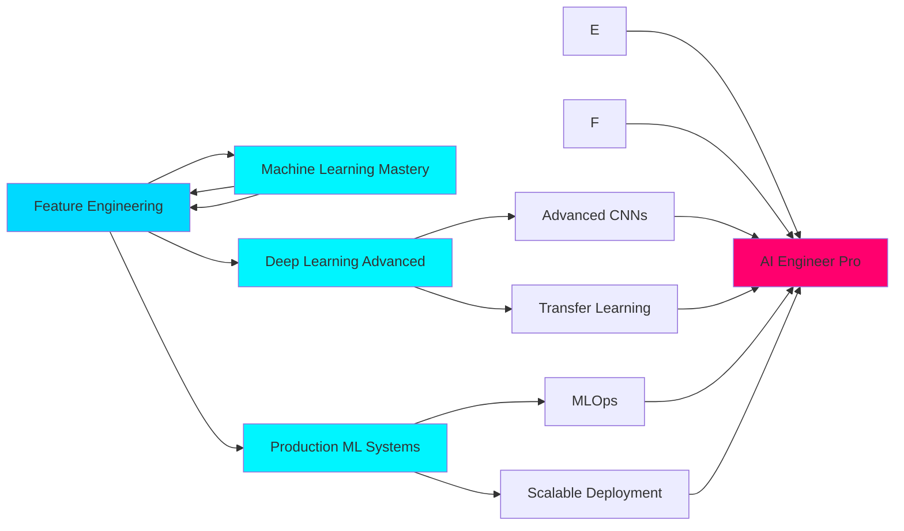

<div align="center">
  
</div>

<p align="center">
  
</p>

<p align="center">
  <a href="https://www.linkedin.com/in/nimitgupta05">
    
  </a>
  <a href="mailto:guptanimit062@gmail.com">
    
  </a>
  <a href="https://github.com/Nimit746">
    
  </a>
  <a href="https://instagram.com/ngupta85_">
    
  </a>
  <a href="https://codepen.io/@Nimit-Gupta">
    
  </a>
</p>

<div align="center">
  
</div>

<br>

<!-- Animated Separator -->


<br>

##  **THE DEVELOPER BEHIND THE CODE**

<div align="center">
  <table>
    <tr>
      <td width="50%" valign="top">
        
### 🎯 **CURRENT MISSION**

```javascript
const developer = {
    name: "Nimit Gupta",
    title: "AI/ML Engineer & Backend Architect",
    location: "Delhi, India 🇮🇳",
    
    workingOn: [
        "End-to-end AI/ML pipelines",
        "Production-grade FastAPI backends",
        "Deep Learning model optimization",
        "Scalable MongoDB architectures"
    ],
    
    philosophy: `
        Code that works ✓
        Code that's understood ✓✓
        Code that's optimized ✓✓✓
    `,
    
    currentlyLearning: {
        deepLearning: ["CNNs", "Neural Networks", "Transfer Learning"],
        mlOps: ["Model Deployment", "Pipeline Optimization"],
        systemDesign: ["ML Services", "API Architecture"],
        bestPractices: ["Clean Code", "SOLID Principles"]
    }
};

console.log("Building the future, one algorithm at a time 🚀");
```

</td>
<td width="50%" valign="top">

### 💭 **PHILOSOPHY & APPROACH**

<br>

> **"I don't just want code that works—**  
> **I want to understand WHY it works**  
> **and HOW to make it BETTER."**

<br>

**My Development Mantra:**

🔍 **Curiosity First** → Question everything  
🧩 **Break It Down** → Complex → Simple  
⚡ **Build & Learn** → Theory meets practice  
🎯 **Optimize Always** → Good → Better → Best  
📚 **Share Knowledge** → Grow together  

<br>

**Impact Over Buzzwords**  
Real-world solutions that matter, not just trends that fade.

</td>
    </tr>
  </table>
</div>

<br>

<!-- Animated Separator -->


<br>

##  **TECH STACK & EXPERTISE**

<div align="center">

### **🤖 ARTIFICIAL INTELLIGENCE & MACHINE LEARNING**

<table>
<tr>
<td align="center" width="20%">

<br><strong>Python</strong>
</td>
<td align="center" width="20%">

<br><strong>TensorFlow</strong>
</td>
<td align="center" width="20%">

<br><strong>PyTorch</strong>
</td>
<td align="center" width="20%">

<br><strong>Scikit-Learn</strong>
</td>
<td align="center" width="20%">

<br><strong>Keras</strong>
</td>
</tr>
</table>

**🔥 Core ML Capabilities**


<br>

### **📊 DATA SCIENCE & ANALYTICS**

<table>
<tr>
<td align="center" width="20%">

<br><strong>NumPy</strong>
</td>
<td align="center" width="20%">

<br><strong>Pandas</strong>
</td>
<td align="center" width="20%">

<br><strong>Matplotlib</strong>
</td>
<td align="center" width="20%">

<br><strong>SciPy</strong>
</td>
<td align="center" width="20%">

<br><strong>OpenCV</strong>
</td>
</tr>
</table>


<br>

### **⚡ BACKEND & API DEVELOPMENT**

<table>
<tr>
<td align="center" width="16.66%">

<br><strong>FastAPI</strong>
</td>
<td align="center" width="16.66%">

<br><strong>MongoDB</strong>
</td>
<td align="center" width="16.66%">

<br><strong>Node.js</strong>
</td>
<td align="center" width="16.66%">

<br><strong>Express.js</strong>
</td>
<td align="center" width="16.66%">

<br><strong>MySQL</strong>
</td>
<td align="center" width="16.66%">

<br><strong>Postman</strong>
</td>
</tr>
</table>


<br>

### **🎨 FRONTEND & UI DEVELOPMENT**

<table>
<tr>
<td align="center" width="14.28%">

<br><strong>React</strong>
</td>
<td align="center" width="14.28%">

<br><strong>JavaScript</strong>
</td>
<td align="center" width="14.28%">

<br><strong>Next.js</strong>
</td>
<td align="center" width="14.28%">

<br><strong>Tailwind CSS</strong>
</td>
<td align="center" width="14.28%">

<br><strong>Bootstrap</strong>
</td>
<td align="center" width="14.28%">

<br><strong>HTML5</strong>
</td>
<td align="center" width="14.28%">

<br><strong>CSS3</strong>
</td>
</tr>
</table>


<br>

### **🛠️ DEVELOPMENT TOOLS & PLATFORMS**

<table>
<tr>
<td align="center" width="12.5%">

<br><strong>GitHub</strong>
</td>
<td align="center" width="12.5%">

<br><strong>Git</strong>
</td>
<td align="center" width="12.5%">

<br><strong>VS Code</strong>
</td>
<td align="center" width="12.5%">

<br><strong>Anaconda</strong>
</td>
<td align="center" width="12.5%">

<br><strong>Streamlit</strong>
</td>
<td align="center" width="12.5%">

<br><strong>Figma</strong>
</td>
<td align="center" width="12.5%">

<br><strong>Canva</strong>
</td>
<td align="center" width="12.5%">

<br><strong>Vite</strong>
</td>
</tr>
</table>

**⚙️ Additional Tools**


<br>

### **💻 PROGRAMMING LANGUAGES**


</div>

<br>

<!-- Animated Separator -->


<br>

##  **WHAT I'M UP TO**

<div align="center">
  <table>
    <tr>
      <td width="33%" align="center">
        <br>
        <h3>🔭 CURRENTLY BUILDING</h3>
        <p align="left">
        ✨ End-to-end AI/ML projects<br>
        🚀 Production-ready ML pipelines<br>
        ⚡ FastAPI backend services<br>
        🗄️ MongoDB integration systems<br>
        🤖 Deep learning models (CNNs)<br>
        🎯 Computer vision applications
        </p>
      </td>
      <td width="33%" align="center">
        <br>
        <h3>🌱 CURRENTLY LEARNING</h3>
        <p align="left">
        🧠 Machine Learning fundamentals<br>
        🔥 Deep Learning (CNNs, RNNs)<br>
        📦 Model deployment strategies<br>
        🏗️ System design for ML services<br>
        ✍️ Clean code practices<br>
        🎨 Scalable architecture patterns
        </p>
      </td>
      <td width="33%" align="center">
        <br>
        <h3>🤝 OPEN TO COLLABORATE</h3>
        <p align="left">
        🤖 Applied AI/ML projects<br>
        🔧 Backend system development<br>
        🌐 Open-source ML tools<br>
        📚 Technical content creation<br>
        💡 Innovative AI solutions<br>
        🚀 Startup projects & MVPs
        </p>
      </td>
    </tr>
  </table>
</div>

<br>

<!-- Animated Separator -->


<br>

##  **GITHUB ANALYTICS**

<div align="center">
  
  
  
</div>

<br>

<div align="center">
  
  
  
</div>

<br>

<div align="center">
  
</div>

<br>

<!-- Animated Separator -->


<br>

##  **EXPERTISE MATRIX**

<div align="center">

| 🎯 **Domain** | 💪 **Proficiency** | 🔥 **Key Skills** |
|:---|:---:|:---|
| **AI/ML Engineering** | ⭐⭐⭐⭐ | Model Development • Training • Optimization • Deployment |
| **Deep Learning** | ⭐ | CNNs • Neural Networks • Transfer Learning • Computer Vision |
| **Backend Development** | ⭐⭐⭐ | FastAPI • REST APIs • MongoDB • Database Design |
| **Data Science** | ⭐⭐⭐⭐ | NumPy • Pandas • Analysis • Visualization • Processing |
| **Frontend Development** | ⭐⭐⭐⭐ | React • Next.js • Tailwind • Responsive Design |
| **System Architecture** | ⭐⭐⭐ | Scalable Design • API Architecture • Production Systems |
| **DevOps & Deployment** | ⭐⭐⭐ | Git • CI/CD • Cloud Platforms |

</div>

<br>

<!-- Animated Separator -->


<br>

##  **LET'S CONNECT & BUILD**

<div align="center">

### 🌟 **I'm Always Excited About:**

</div>

<table align="center">
<tr>
<td width="50%" valign="top">

### 💡 **Ask Me About**

🐍 **Python Programming**  
→ Best practices, design patterns, optimization

🤖 **Machine Learning**  
→ Model building, training, evaluation, deployment

⚡ **FastAPI Development**  
→ API design, async programming, authentication

🗄️ **MongoDB & Databases**  
→ Schema design, queries, optimization

🏗️ **Project Architecture**  
→ Structuring scalable applications

📚 **Technical Concepts**  
→ Explaining complex ideas simply

</td>
<td width="50%" valign="top">

### 🤝 **Looking for Help With**

🚀 **Advanced Deployment**  
→ ML model serving at scale

🏛️ **System Design**  
→ Architecture for ML services

✨ **Code Quality**  
→ Writing cleaner, more maintainable code

🎯 **Best Practices**  
→ Production ML pipelines

🔧 **DevOps for ML**  
→ MLOps practices and tools

🌐 **Open Source**  
→ Contributing effectively to projects

</td>
</tr>
</table>

<br>

<div align="center">

### 📬 **Reach Out & Collaborate**

<table>
  <tr>
    <td align="center" width="25%">
      <a href="https://www.linkedin.com/in/nimitgupta05">
        
      </a>
      <br><sub>Professional Network</sub>
    </td>
    <td align="center" width="25%">
      <a href="mailto:guptanimit062@gmail.com">
        
      </a>
      <br><sub>Direct Message</sub>
    </td>
    <td align="center" width="25%">
      <a href="https://github.com/Nimit746">
        
      </a>
      <br><sub>Code Portfolio</sub>
    </td>
    <td align="center" width="25%">
      <a href="https://instagram.com/ngupta85_">
        
      </a>
      <br><sub>Daily Updates</sub>
    </td>
  </tr>
</table>

<br>

**Additional Platforms**

<a href="https://codepen.io/@Nimit-Gupta">
  
</a>

</div>

<br>

<!-- Animated Separator -->


<br>

## 🎓 **LEARNING ROADMAP 2025**

<div align="center">



</div>

<br>

<!-- Animated Separator -->


<br>

## 💭 **DEVELOPMENT PHILOSOPHY**

<div align="center">
  
</div>

<br>

<div align="center">

### **"Code is not just about making things work—**
### **it's about understanding WHY they work**
### **and continuously making them BETTER."**

<br>

<table>
<tr>
<td align="center" width="25%">
<br>
<strong>Understand Deeply</strong><br>
<sub>Question. Research. Learn.</sub>
</td>
<td align="center" width="25%">
<br>
<strong>Build Iteratively</strong><br>
<sub>Prototype. Test. Refine.</sub>
</td>
<td align="center" width="25%">
<br>
<strong>Optimize Always</strong><br>
<sub>Measure. Improve. Repeat.</sub>
</td>
<td align="center" width="25%">
<br>
<strong>Share Knowledge</strong><br>
<sub>Document. Teach. Grow.</sub>
</td>
</tr>
</table>

<br>

**🎯 Core Principles:**

💎 **Quality Over Quantity** • Real impact beats buzzwords  
🔍 **Curiosity Driven** • Always asking "why" and "how"  
🚀 **Production Mindset** • Build for real-world deployment  
📚 **Learn in Public** • Share the journey, help others grow  
🤝 **Collaborate Actively** • Best solutions come from teamwork  

</div>

<br>

<!-- Animated Separator -->


<br>

## ✍️ **RANDOM DEV WISDOM**

<div align="center">
  
</div>

<br>

<!-- Animated Separator -->


<br>

## 🏆 **ACHIEVEMENTS & RECOGNITION**

<div align="center">
  
### **GitHub Contributions**


<br><br>

### **Contribution Stats**


</div>

<br>

<!-- Animated Separator -->


<br>

## 📊 **WEEKLY DEVELOPMENT BREAKDOWN**

<div align="center">

<!--START_SECTION:waka-->
```text
Python       12 hrs 45 mins  ████████████░░░░░░░░  55.2%
JavaScript    5 hrs 30 mins  ██████░░░░░░░░░░░░░░  23.8%
MongoDB       2 hrs 15 mins  ███░░░░░░░░░░░░░░░░░  09.8%
JSON          1 hr 20 mins   ██░░░░░░░░░░░░░░░░░░  05.8%
Markdown      1 hr 15 mins   █░░░░░░░░░░░░░░░░░░░  05.4%
```
<!--END_SECTION:waka-->

</div>

<br>

<!-- Animated Separator -->


<br>

<div align="center">
  
  
  
  ### 💫 **"Building Tomorrow's Solutions with Today's Code"**
  
  <sub>Currently architecting intelligent systems • Learning in public • Growing together 🚀</sub>
  
  <br><br>
  
  
  
  
  
  <br>
  
  **⭐ Star my repositories if you find them helpful!**
  
</div>

<br>

<!-- Footer Animation -->
<div align="center">
  
</div>

<div align="center">
  <sub>Made with 💜 by <a href="https://github.com/Nimit746">Nimit Gupta</a> • Powered by curiosity, coffee, and countless iterations ☕✨</sub>
</div>
