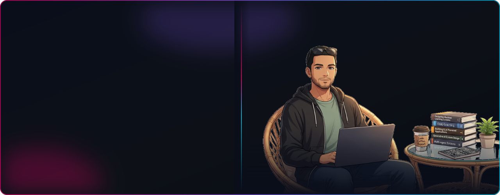

<div align="center">
  <picture>
    <source media="(prefers-color-scheme: dark)" srcset="banner.svg">
    <source media="(prefers-color-scheme: light)" srcset="banner.svg">
    
  </picture>
</div>

<p align="center">
  <a href="https://www.linkedin.com/in/nimitgupta05">
    
  </a>
  <a href="mailto:guptanimit062@gmail.com">
    
  </a>
  <a href="https://github.com/Nimit746">
    
  </a>
  <a href="https://instagram.com/ngupta85_">
    
  </a>
  <a href="https://codepen.io/@Nimit-Gupta">
    
  </a>
</p>

<div align="center">
  
</div>

<br>

---

## 🧑‍💻 **THE DEVELOPER BEHIND THE CODE**

<div align="center">
  <table>
    <tr>
      <td width="50%" valign="top">
        
### 🎯 **CURRENT MISSION**

```python
developer = {
    "name": "Nimit Gupta",
    "title": "AI/ML Engineer & Backend Architect",
    "location": "Delhi, India 🇮🇳",

    "working_on": [
        "End-to-end AI/ML pipelines",
        "Production-grade FastAPI backends",
        "Deep Learning model optimization",
        "Scalable MongoDB architectures",
    ],

    "philosophy": """
    Code that works ✓
    Code that's understood ✓✓
    Code that's optimized ✓✓✓
    """,

    "currently_learning": {
        "deep_learning": [
            "CNNs",
            "Neural Networks",
            "Transfer Learning",
        ],
        "ml_ops": [
            "Model Deployment",
            "Pipeline Optimization",
        ],
        "system_design": [
            "ML Services",
            "API Architecture",
        ],
        "best_practices": [
            "Clean Code",
            "SOLID Principles",
        ],
    },
}

print("Building the future, one algorithm at a time 🚀")
```

</td>
<td width="50%" valign="top">

### 💭 **PHILOSOPHY & APPROACH**

<br>

> **"I don't just want code that works—**  
> **I want to understand WHY it works**  
> **and HOW to make it BETTER."**

<br>

**My Development Mantra:**

🔍 **Curiosity First** → Question everything  
🧩 **Break It Down** → Complex → Simple  
⚡ **Build & Learn** → Theory meets practice  
🎯 **Optimize Always** → Good → Better → Best  
📚 **Share Knowledge** → Grow together  

<br>

**Impact Over Buzzwords**  
Real-world solutions that matter, not just trends that fade.

</td>
    </tr>
  </table>
</div>

<br>

---

## 🛠️ **TECH STACK & EXPERTISE**

<div align="center">

### **🤖 ARTIFICIAL INTELLIGENCE & MACHINE LEARNING**

<table>
<tr>
<td align="center" width="20%">

<br><strong>Python</strong>
</td>
<td align="center" width="20%">

<br><strong>TensorFlow</strong>
</td>
<td align="center" width="20%">

<br><strong>PyTorch</strong>
</td>
<td align="center" width="20%">

<br><strong>Scikit-Learn</strong>
</td>
<td align="center" width="20%">

<br><strong>Keras</strong>
</td>
</tr>
</table>

**🔥 Core ML Capabilities**


<br>

### **📊 DATA SCIENCE & ANALYTICS**

<table>
<tr>
<td align="center" width="20%">

<br><strong>NumPy</strong>
</td>
<td align="center" width="20%">

<br><strong>Pandas</strong>
</td>
<td align="center" width="20%">

<br><strong>Matplotlib</strong>
</td>
<td align="center" width="20%">

<br><strong>SciPy</strong>
</td>
<td align="center" width="20%">

<br><strong>OpenCV</strong>
</td>
</tr>
</table>

<br>

### **⚡ BACKEND & API DEVELOPMENT**

<table>
<tr>
<td align="center" width="16.66%">

<br><strong>FastAPI</strong>
</td>
<td align="center" width="16.66%">

<br><strong>MongoDB</strong>
</td>
<td align="center" width="16.66%">

<br><strong>Node.js</strong>
</td>
<td align="center" width="16.66%">

<br><strong>Express.js</strong>
</td>
<td align="center" width="16.66%">

<br><strong>MySQL</strong>
</td>
<td align="center" width="16.66%">

<br><strong>Postman</strong>
</td>
</tr>
</table>

<br>

### **🎨 FRONTEND & UI DEVELOPMENT**

<table>
<tr>
<td align="center" width="14.28%">

<br><strong>React</strong>
</td>
<td align="center" width="14.28%">

<br><strong>JavaScript</strong>
</td>
<td align="center" width="14.28%">

<br><strong>Next.js</strong>
</td>
<td align="center" width="14.28%">

<br><strong>Tailwind CSS</strong>
</td>
<td align="center" width="14.28%">

<br><strong>Bootstrap</strong>
</td>
<td align="center" width="14.28%">

<br><strong>HTML5</strong>
</td>
<td align="center" width="14.28%">

<br><strong>CSS3</strong>
</td>
</tr>
</table>

</div>

<br>

---

## 📊 **GITHUB ANALYTICS**

<div align="center">
  
  
</div>

<br>

---

## 🐍 **CONTRIBUTIONS**

<div align="center">
  <picture>
    <source media="(prefers-color-scheme: dark)" srcset="https://raw.githubusercontent.com/Nimit746/Nimit746/output/github-snake-dark.svg">
    <source media="(prefers-color-scheme: light)" srcset="https://raw.githubusercontent.com/Nimit746/Nimit746/output/github-snake.svg">
    
  </picture>
</div>

<br>

<div align="center">
  
  
</div>

<br>

---

## 🏆 **GITHUB TROPHIES**

<div align="center">
  
</div>

<br>

---

## 📊 **WEEKLY DEVELOPMENT BREAKDOWN**

<div align="center">

<!--START_SECTION:waka-->
```text
Python       12 hrs 45 mins  ████████████░░░░░░░░  55.2%
JavaScript    5 hrs 30 mins  ██████░░░░░░░░░░░░░░  23.8%
MongoDB       2 hrs 15 mins  ███░░░░░░░░░░░░░░░░░  09.8%
JSON          1 hr 20 mins   ██░░░░░░░░░░░░░░░░░░  05.8%
Markdown      1 hr 15 mins   █░░░░░░░░░░░░░░░░░░░  05.4%
```
<!--END_SECTION:waka-->

</div>

<br>

---

## 🎓 **LEARNING ROADMAP 2025**

<div align="left">

### 🚀 **Phase 1: Production Mastery** (In Progress)
- [x] End-to-end Machine Learning pipelines
- [x] Deep Learning Fundamentals (CNNs, PyTorch)
- [ ] Advanced Feature Engineering & Optimization

### 🏗️ **Phase 2: Scalable Architecture**
- [ ] Microservices with FastAPI & Docker
- [ ] System Design for High-Traffic ML Services

### 🔮 **Phase 3: AI Engineer Pro**
- [ ] Advanced MLOps (CI/CD for ML models)
- [ ] Large Language Models (LLMs) Integration
- [ ] Open Source AI Contributions

</div>

<br>

---

## 🤝 **LET'S CONNECT & BUILD**

<div align="center">
<table>
  <tr>
    <td align="center" width="25%">
      <a href="https://www.linkedin.com/in/nimitgupta05">
        
      </a>
      <br><sub>Professional Network</sub>
    </td>
    <td align="center" width="25%">
      <a href="mailto:guptanimit062@gmail.com">
        
      </a>
      <br><sub>Direct Message</sub>
    </td>
    <td align="center" width="25%">
      <a href="https://github.com/Nimit746">
        
      </a>
      <br><sub>Code Portfolio</sub>
    </td>
    <td align="center" width="25%">
      <a href="https://instagram.com/ngupta85_">
        
      </a>
      <br><sub>Daily Updates</sub>
    </td>
  </tr>
</table>

<br>


<br>

**⭐ Star my repositories if you find them helpful!**

<br>
<sub>Made with 💜 by <a href="https://github.com/Nimit746">Nimit Gupta</a> • Powered by curiosity, coffee, and countless iterations ☕✨</sub>
</div>
